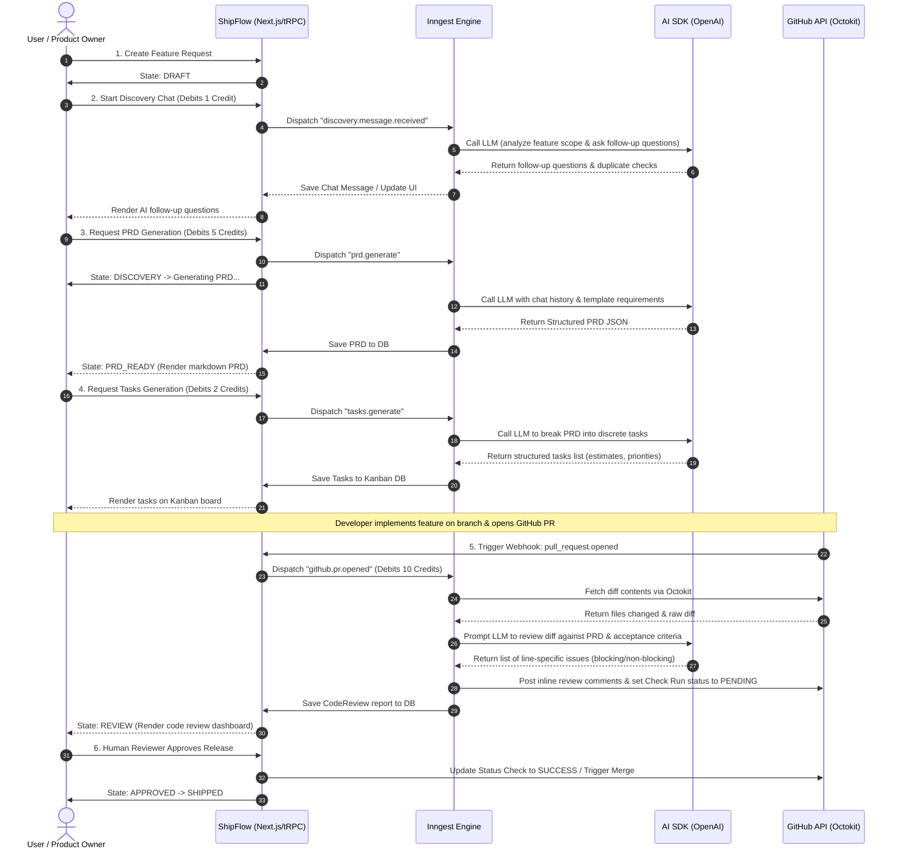
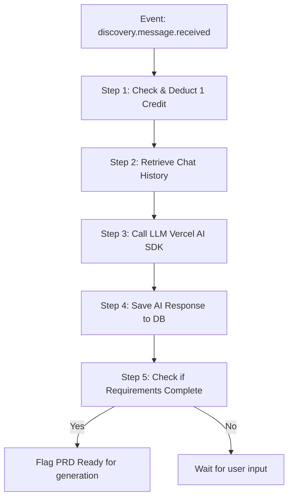

# ShipFlow AI - AI Workflows & Inngest Integration

This document outlines the AI workflows powered by Vercel AI SDK and managed asynchronously by Inngest, detailing the complete Feature Request → Shipped flow, credit consumption limits, and background pipelines.

---

## Feature Request → Shipped Sequence Diagram

---

## Inngest Background Workflows

Inngest is used to model durable, multi-step workflows. If the LLM call fails or rate limits are hit, Inngest will automatically retry the step.

### 1. Discovery Chat Workflow (`discovery.message.received`)
Triggers whenever the user posts a message inside the Feature Discovery tab.
* **Steps**:
  1. Deduct 1 credit from Workspace balance.
  2. Query database for context: all historical message exchanges in the discovery session.
  3. Perform a semantic check/vector search (optional) to flag duplicate feature requests.
  4. Prompt LLM to extract requirements, identify missing specifications, and formulate follow-up questions.
  5. Store response in the database.

### 2. PRD Generation Workflow (`prd.generate`)
Generates an standard engineering PRD from the Feature description and discovery log.
* **Steps**:
  1. Check and deduct 5 credits.
  2. Call OpenAI model requesting structured JSON payload adhering to the PRD schema:
     * Problem Statement
     * Goals and Non-Goals
     * User Stories
     * Acceptance Criteria
     * Success Metrics
  3. Save generated PRD content to database. Set feature status to `PRD_READY`.

### 3. Engineering Tasks Generator (`tasks.generate`)
Converts PRD acceptance criteria into actionable tasks.
* **Steps**:
  1. Deduct 2 credits.
  2. Call LLM with the PRD markdown.
  3. Request structured array matching the `Task` schema:
     * Title, Description
     * Priority (`LOW`, `MEDIUM`, `HIGH`, `URGENT`)
     * Estimates (in minutes)
     * Dependencies (references to other generated tasks index)
  4. Write Tasks records to database pointing to the Kanban board.

### 4. PR Code Review Workflow (`github.pr.opened` / `github.pr.sync`)
Reviews incoming pull request diffs against the PRD.
* **Steps**:
  1. Deduct 10 credits.
  2. Trigger GitHub check run state: `in_progress`.
  3. Fetch file list and complete diffs from GitHub.
  4. Fetch target PRD and Kanban task requirements from database.
  5. Query LLM to inspect diffs line-by-line, matching against the acceptance criteria, searching for security/performance flaws.
  6. Call Octokit to post inline comments on code lines for blocking issues.
  7. If blocking issues exist: Set GitHub status to `failure` (blocking merge).
  8. If passes: Set GitHub status to `success` (if human approved or awaiting human approval).

---

## AI Credits Configuration

Credits are tracked in the `AiCredit` table and managed by transactional logs in `AiCreditLog`.

| Feature Action | Credit Cost | Usage Trigger |
| :--- | :--- | :--- |
| **Discovery Chat** | 1 Credit | Every user message sent to AI Discovery |
| **PRD Generation** | 5 Credits | Initial generation of the PRD |
| **Task Generation** | 2 Credits | Initial generation of Kanban Tasks |
| **Repository Analysis**| 5 Credits | Initial repository linking crawl |
| **Pull Request Review**| 10 Credits | Automated Code Review run on PR open/sync |
| **Release Readiness**  | 3 Credits | Pre-deployment compliance/lint scan |

### Tier Allocations

Subscriptions managed via Razorpay grant recurring monthly credits:
* **Free Tier**: 50 credits/month, maximum 1 workspace, 1 connected repository.
* **Pro Tier**: 1,000 credits/month, unlimited workspaces, 5 repositories.
* **Enterprise Tier**: Custom credit limits (unlimited), customizable models, dedicated workspace routing.
