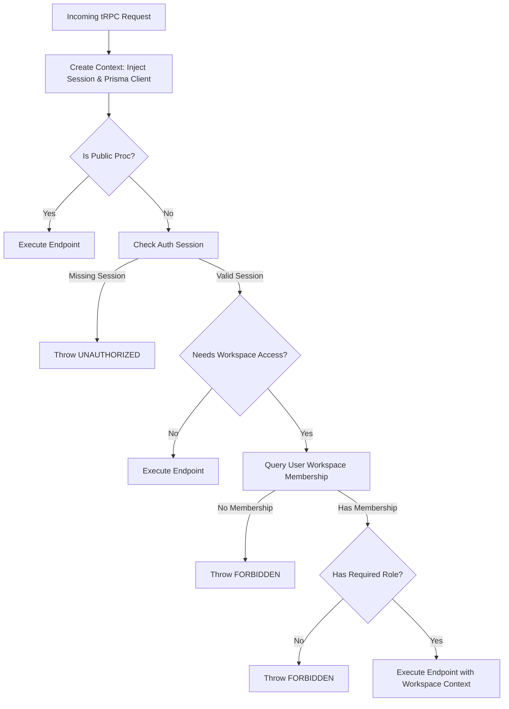

# ShipFlow AI - API Documentation (tRPC Router Structure)

This document maps out the tRPC API router architecture, listing the key procedures, route structures, validation rules, and context requirements.

---

## Router Tree

```
root
├── auth
│   └── getSession
├── workspace
│   ├── create
│   ├── get
│   ├── update
│   ├── inviteMember
│   ├── removeMember
│   └── listMembers
├── project
│   ├── create
│   ├── list
│   ├── get
│   └── connectGithub
├── feature
│   ├── create
│   ├── list
│   ├── get
│   ├── submitDiscoveryMessage
│   └── generatePrd
├── task
│   ├── generateTasks
│   ├── list
│   ├── update
│   └── updateKanbanOrder
├── review
│   ├── list
│   ├── get
│   └── submitHumanApproval
└── billing
    ├── getSubscription
    ├── createSubscriptionSession
    └── getCredits
```

---

## Context and Middleware Lifecycle

To ensure strict data security and tenant isolation, every incoming request passes through a sequence of validation middlewares:



---

## Procedures Reference

### 1. Auth Router (`auth`)
* `getSession()`: Returns current authenticated user and organization memberships.
  * **Auth**: Public (returns null if unauthenticated).

### 2. Workspace Router (`workspace`)
* `create(input: { name: string })`: Creates a new workspace and registers the creator as `OWNER`.
  * **Auth**: Protected.
* `get()`: Fetches workspace meta details.
  * **Auth**: Workspace member.
* `update(input: { name: string })`: Renames workspace.
  * **Auth**: Workspace owner/admin.
* `inviteMember(input: { email: string, role: Role })`: Generates a pending invitation.
  * **Auth**: Workspace owner/admin.
* `removeMember(input: { memberId: string })`: Deletes a workspace membership.
  * **Auth**: Workspace owner/admin.

### 3. Project Router (`project`)
* `create(input: { name: string, description: string })`: Creates a project within the workspace.
  * **Auth**: Workspace member (Developer or higher).
* `list()`: Returns all active projects in the current workspace.
  * **Auth**: Workspace member.
* `connectGithub(input: { projectId: string, repository: string })`: Links a GitHub repository (`owner/repo`) to a project.
  * **Auth**: Workspace owner/admin.

### 4. Feature Router (`feature`)
* `create(input: { projectId: string, title: string, description: string })`: Submits a feature request.
  * **Auth**: Workspace member (Customer/Developer or higher).
* `submitDiscoveryMessage(input: { featureId: string, message: string })`: Sends customer response to AI Discovery chatbot. Debits **1 credit**.
  * **Auth**: Workspace member.
* `generatePrd(input: { featureId: string })`: Manually schedules PRD generation. Debits **5 credits**.
  * **Auth**: Workspace member (Developer or higher).

### 5. Task Router (`task`)
* `generateTasks(input: { prdId: string })`: Converts generated PRD to Engineering tasks. Debits **2 credits**.
  * **Auth**: Workspace member (Developer or higher).
* `list(input: { projectId: string })`: Fetches tasks for Kanban view.
  * **Auth**: Workspace member.
* `update(input: { taskId: string, status: TaskStatus })`: Changes status column of task.
  * **Auth**: Workspace member.

### 6. Review Router (`review`)
* `list(input: { projectId: string })`: Lists code reviews.
  * **Auth**: Workspace member.
* `submitHumanApproval(input: { reviewId: string, decision: "APPROVE" | "REJECT", comment?: string })`: Records human decision, updates GitHub status checks.
  * **Auth**: Workspace member (Developer or higher).

### 7. Billing Router (`billing`)
* `createSubscriptionSession(input: { plan: "PRO" | "ENTERPRISE" })`: Returns Razorpay transaction payload.
  * **Auth**: Workspace owner/admin.
* `getCredits()`: Returns current credit balance and ledger logs.
  * **Auth**: Workspace member.
