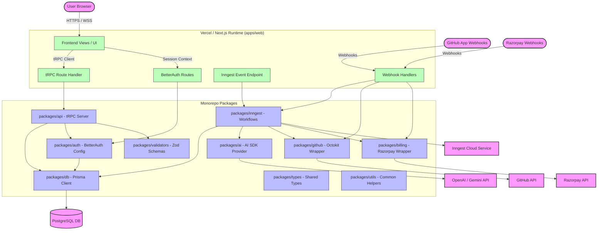
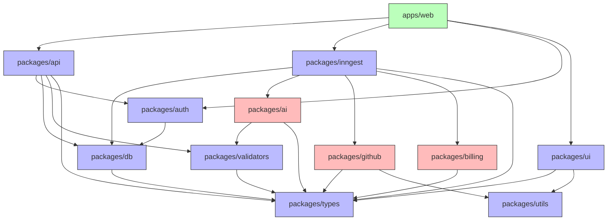

# ShipFlow AI - System Architecture

This document describes the high-level architecture, package dependency graph, and module layout of the ShipFlow AI Turborepo workspace.

---

## High-Level Architecture

The platform follows a clean, decoupled architecture. Client requests are routed through a unified Next.js entrypoint that handles authentication (BetterAuth), API routes (tRPC), and background workflows (Inngest).

---

## Package Dependency Diagram

To prevent circular dependencies and maintain clean boundaries, we enforce a strict unidirectional dependency graph. Lower-level packages must not import from higher-level packages.

---

## Package Responsibilities

### 1. Applications (`apps/`)
* **`apps/web`**: Contains the Next.js application structure (pages, client hooks, public endpoints, stylesheets). All routes are handled here. Direct access to database schemas is prohibited; any write/read actions are mediated through tRPC procedures or Inngest background operations.

### 2. Core Packages (`packages/`)
* **`packages/db`**: Manages the Prisma schema and client instance. Restricts raw database connections across the codebase, ensuring transaction consistency and pool reuse.
* **`packages/api`**: Holds tRPC routers, query/mutation validation, context injection, and security middlewares.
* **`packages/auth`**: Configures BetterAuth with Prisma Adapters, workspace multi-tenancy rules, and role validations.
* **`packages/inngest`**: Defines background workflow orchestrations, triggers, and state retries.
* **`packages/ui`**: Encapsulates React components built on Tailwind CSS v4 and Shadcn UI.
* **`packages/validators`**: Contains shared Zod schema validators (e.g., project name patterns, credit purchase checks) to assert object shapes at compile and API ingestion times.
* **`packages/types`**: Declares shared TypeScript interfaces, database extensions, and type bindings used across multiple modules.
* **`packages/utils`**: Outlines common helper libraries (e.g., standard text string parsers, date formatters, environment variable assertions).

### 3. Service Packages (`packages/`)
* **`packages/ai`**: Provider-agnostic AI pipeline powered by the Vercel AI SDK. Maps custom interfaces to API endpoints (defaulting to OpenAI's latest models, with simple environment toggle capability).
* **`packages/github`**: Octokit-based utility handlers that process commit histories, fetch file diffs, initialize repository check runs, and submit code review threads.
* **`packages/billing`**: Integrates with the Razorpay client to issue payments, record subscriptions, and trace billing webhooks.
