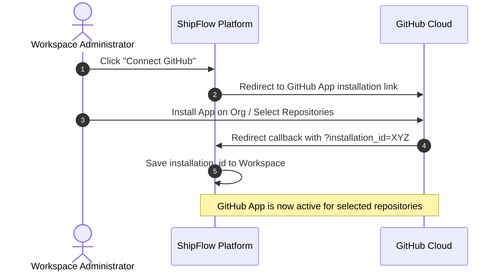

# ShipFlow AI - GitHub Integration

This document outlines the GitHub App configuration, webhook processing layout, Check Runs API implementation, and automated inline PR comments structure.

---

## Architecture Overview

Instead of OAuth authentication, ShipFlow AI integrates as a **GitHub App**. This model supports workspace-specific installations, fine-grained access tokens, and webhook configurations.



---

## GitHub App Setup Parameters

To initialize the GitHub App on your development or production organization, configure the app settings with the following values:

### 1. Permissions & Events

| Permission Area | Level | Context | Events Selected |
| :--- | :--- | :--- | :--- |
| **Pull Requests** | Read & Write | Create review comments, files diff reviews | `pull_request` (opened, synchronize, closed) |
| **Checks** | Read & Write | Register checks, block merging until human approval | `check_run` (requested, rerequested) |
| **Contents** | Read-only | Fetch file blobs and raw commit diffs | None |
| **Metadata** | Read-only | Access base repo info (required for all apps) | None |

### 2. Environment Configuration
Store these values in `/apps/web/.env.local`:
* `GITHUB_APP_ID`: The unique app ID provided by GitHub.
* `GITHUB_PRIVATE_KEY`: The contents of the generated `.pem` private key file.
* `GITHUB_WEBHOOK_SECRET`: Secure token verifying that webhook payloads originate from GitHub.

---

## Webhook Handler Lifecycle

All incoming webhooks arrive at `/api/github/webhook`. 

### Webhook Verification
Each payload contains a header: `x-hub-signature-256`. 
We must verify this signature using `crypto.createHmac("sha256", GITHUB_WEBHOOK_SECRET)` on the raw request body before parsing to prevent request spoofing.

### Event Processing Loop
Once validated, we dispatch events to Inngest for background execution:

```typescript
// Example endpoint logic inside apps/web/src/app/api/github/webhook/route.ts
export async function POST(req: Request) {
  const body = await req.text();
  const signature = req.headers.get("x-hub-signature-256");
  
  if (!verifySignature(body, signature, process.env.GITHUB_WEBHOOK_SECRET)) {
    return new Response("Unauthorized Signature", { status: 401 });
  }

  const payload = JSON.parse(body);
  const eventName = req.headers.get("x-github-event");

  if (eventName === "pull_request") {
    if (payload.action === "opened" || payload.action === "synchronize") {
      // Send event to Inngest
      await inngest.send({
        name: "github/pr.opened",
        data: {
          installationId: payload.installation.id,
          repository: payload.repository.full_name,
          pullNumber: payload.pull_request.number,
          commitSha: payload.pull_request.head.sha,
        }
      });
    }
  }

  return new Response("OK", { status: 200 });
}
```

---

## Octokit Client Wrapper

`packages/github` exports a service to create authenticated Octokit instances on-the-fly using the cached workspace `installation_id`:

```typescript
import { Octokit } from "@octokit/rest";
import { createAppAuth } from "@octokit/auth-app";

export function getGitHubClient(installationId: string) {
  return new Octokit({
    authStrategy: createAppAuth,
    auth: {
      appId: process.env.GITHUB_APP_ID!,
      privateKey: process.env.GITHUB_PRIVATE_KEY!,
      installationId: installationId,
    },
  });
}
```

---

## GitHub Checks & Code Review Logic

### 1. Creating a Check Run
When a PR is opened, the Inngest workflow immediately initializes a check run:
```typescript
const octokit = getGitHubClient(installationId);
const checkRun = await octokit.checks.create({
  owner,
  repo,
  name: "ShipFlow AI Code Review",
  head_sha: commitSha,
  status: "in_progress",
  started_at: new Date().toISOString(),
});
```

### 2. Submitting Inline Comments
As the Vercel AI SDK flags file-level warnings, we map comments directly to specific lines and submit a multi-line review:
```typescript
await octokit.pulls.createReview({
  owner,
  repo,
  pull_number: pullNumber,
  event: "COMMENT",
  body: "ShipFlow AI has analyzed this PR. Review the feedback inline below.",
  comments: [
    {
      path: "src/db/connect.ts",
      line: 12,
      side: "RIGHT",
      body: "**[BLOCKING]** Potential database connection leak. Ensure the pool is closed or re-used.",
    }
  ]
});
```

### 3. Resolving the Check (Human Approval Hook)
When the Human Reviewer clicks "Approve" inside the ShipFlow UI:
1. ShipFlow calls the tRPC router: `review.submitHumanApproval`.
2. The router queries the associated PR details.
3. The router calls GitHub API to update the Check Run:
```typescript
await octokit.checks.update({
  owner,
  repo,
  check_run_id: checkRunId,
  status: "completed",
  conclusion: "success",
  completed_at: new Date().toISOString(),
  output: {
    title: "Approved by Human Reviewer",
    summary: "ShipFlow AI review finished successfully and human approval has been granted.",
  }
});
```
4. If repository auto-merge is active, we trigger `octokit.pulls.merge({ owner, repo, pull_number })`.
